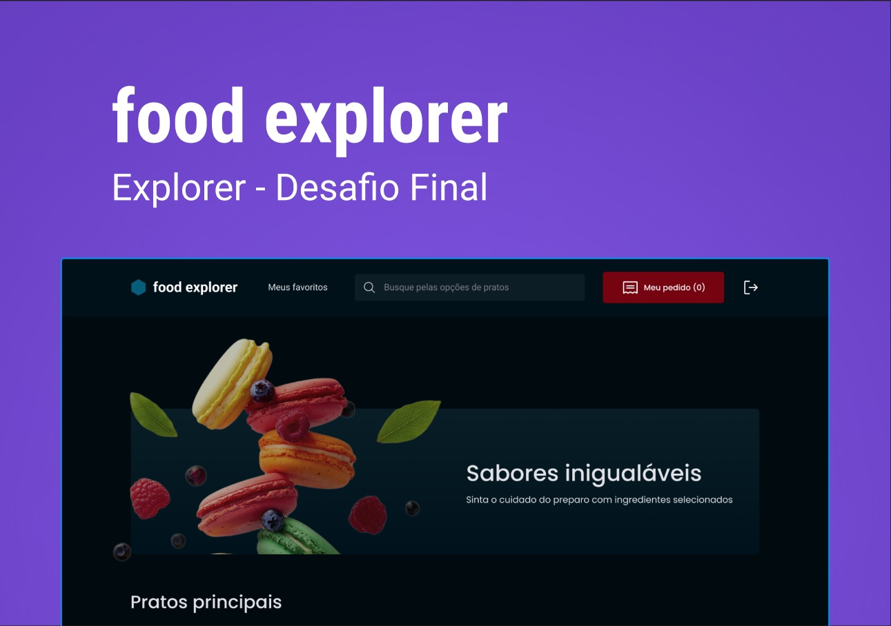
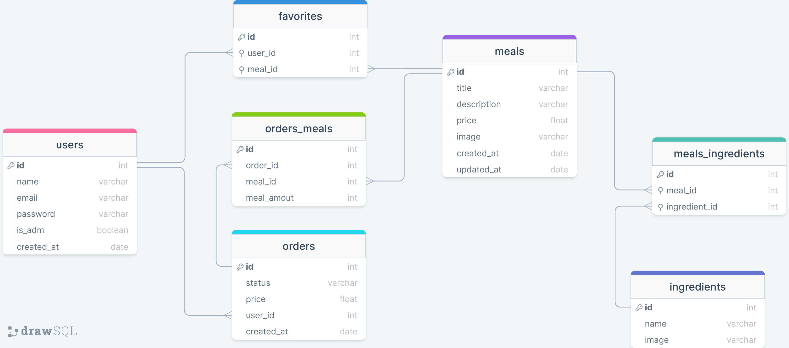

# :pizza: foodExplorer - Backend

Esse projeto é um cardápio digital para um restaurante fictício, conhecido como foodExplorer.

<h1 align="center">
    
</h1>

## :open_book: Sumário

- [Aviso](#loudspeaker-aviso)
- [Sobre](#memo-sobre)
- [Tecnologias](#floppy_disk-tecnologias)
- [Funcionalidades](#hammer-funcionalidades)
- [Utilização](#bulb-utilização)
- [Autor](#nerd_face-autor)

</br>

## :loudspeaker: Aviso

- A primeira versão do projeto **está finalizada**.

- Para testar o projeto, você pode utilizar essa url https://food-explorer.onrender.com, ou então clonar o repositório e testar localmente utilizando o NodeJS e o Insomnia.

- Você pode baixar o NodeJS [clicando aqui](https://nodejs.org/pt-br/download/).

- Você pode baixar o Insomnia [clicando aqui](https://insomnia.rest/download).

- A modelagem do banco de dados foi feita por mim.

</br>

## :memo: Sobre

Este é backend do Desafio Final do programa [Explorer da Rocketseat](https://www.rocketseat.com.br/explorer).

Essa aplicação simula um restaurante fictício, conhecido como foodExplorer, aonde usuários podem se cadastrar e logar.

Sendo o usuário um Administrador, ele poderá adicionar pratos, ingredients, atualizar pedidos, etc.

Sendo o usuário um Cliente, ele poderá atualizar o perfil, fazer um pedido, adicionar um produto as favoritos, etc.

Abaixo, temos a modelagem do banco de dados:

<h1 align="center">
    
</h1>

</br>

## :floppy_disk: Tecnologias

- **JS** - usado para fazer toda a lógica da aplicação;
- **NodeJs** - utilizado para executar o JS fora do navegador;
- **Express** - responsável por lidar com as requisições HTTP;
- **Jest** - utilizado para realizar testes de integração;
- **Sqlite** - usado para armazenar os dados;
- **Knex** - utilizado para gerar comandos SQL;
- **Multe** - usado para gerenciar o upload de imagens.
- **Git** - responsável por realizar o versionamento do código.

</br>

## :hammer: Funcionalidades

- [x] Cadastrar um usuário;
- [x] Atualizar e-mail, senha, ou nome de um usuário.
- [x] Mostrar informações de um pedido especifico;
- [x] Mostrar todos os pedidos de um usuário ou de todos os usuários.
- [x] Cadastrar, atualizar, mostrar ou deletar um prato.
- [x] Cadastrar, ou mostrar um ingrediente.
- [x] Criar, atualizar, mostrar informações de um pedido.

</br>

## :bulb: Utilização

- [Iniciando a aplicação](#iniciando-a-aplicação)
- [Usando os recursos](#usando-os-recursos)
  - [Seções](#seções)
    - [Criar](#criar-uma-seção)
  - [Usuários](#usuários)
    - [Cadastrar](#cadastrar-um-usuário)
    - [Atualizar](#atualizar-um-usuário)
  - [Pratos](#pratos)
    - [Cadastrar](#cadastrar-um-prato)
    - [Atualizar](#atualizar-um-prato)
    - [Mostrar todos](#mostrar-todos-os-pratos)
    - [Pesquisar](#pesquisar-um-prato)
    - [Mostrar especifico](#mostrar-um-prato-especifico)
    - [Deletar](#deletar-um-prato)
    - [Atualizar foto](#atualizar-a-foto-de-um-prato)
  - [Ingredientes](#ingredientes)
    - [Cadastrar](#cadastrar-um-ingrediente)
    - [Atualizar foto](#atualizar-a-foto-de-um-ingrediente)
    - [Mostrar todos](#mostrar-todos-os-ingredientes)
  - [Favoritos](#favoritos)
    - [Adicionar](#adicionar-um-favorito)
    - [Remover](#remover-um-favorito)
    - [Mostrar todos](#mostrar-todos-os-favoritos)
  - [Pedidos](#pedidos)
    - [Cadastrar](#cadastrar-um-pedido)
    - [Atualizar](#atualizar-um-pedido)
    - [Mostrar um](#mostrar-um-pedido)
    - [Mostrar todos](#mostrar-todos-os-pedidos)
  - [Fotos](#fotos)
    - [Prato](#mostrar-a-foto-de-um-prato)
    - [Ingrediente](#mostrar-a-foto-de-um-ingrediente)

### _Iniciando a aplicação_

- Comece clonando o projeto:

  ```bash
    $git clone https://github.com/devgustavosantos/food_explorer-backend
  ```

- Entre no diretório:

  ```bash
    $cd food_explorer-backend/
  ```

- Instale as dependências:

  ```bash
    $npm install
  ```

- Defina as variáveis locais. Exemplo:

  ```JS
    ADMIN_EMAIL=@admin.com
    PORT=3333
    AUTH_SECRET=698dc19d489c4e4db73e28a713eab07b
  ```

- Instale as dependências:

  ```bash
    $npm install
  ```

- Inicie o servidor local:

  ```bash
    $npm run dev
  ```

- Se tudo der certo, a seguinte mensagem vai aparecer no terminal/console:

  ```bash
    Server is running on port 3333.
  ```

- Para utilizar todo dos recursos desta API, vamos utilizar a seguinte URL base:

  `http://localhost:3333`

- E para fazer as requisições usaremos o Insomnia.

### _Usando os recursos_

Como dentro da aplicação existem três tipos de personas, os recursos foram divididos em três tipos de categorias:

- Todos:

  - Mostrar todos os pratos
  - Pesquisar um prato
  - Mostrar um prato especifico
  - Mostrar todos os ingredientes
  - Mostrar a foto de um prato
  - Mostrar a foto de um ingrediente

- Público (que não fez login ainda):

  - Criar uma seção
  - Cadastrar um usuário
  - Mostrar todos os pratos
  - Pesquisar um prato
  - Mostrar um prato especifico
  - Mostrar todos os ingredientes
  - Mostrar a foto de um prato
  - Mostrar a foto de um ingrediente

- Cliente:

  - Atualizar um Usuário
  - Adicionar um favorito
  - Remover um favorito
  - Mostrar todos os favoritos
  - Cadastrar um pedido
  - Mostrar um pedido
  - Mostrar todos os pedidos

- Administrador:

  - Atualizar um Usuário
  - Cadastrar um prato
  - Atualizar um prato
  - Deletar um prato
  - Atualizar a foto de um prato
  - Cadastrar um ingrediente
  - Atualizar a foto de um ingrediente
  - Atualizar um pedido
  - Mostrar um pedido
  - Mostrar todos os pedidos

- #### **SEÇÕES**

  - ##### **Criar uma Seção**

    Para quase todas as requisições, a aplicação espera um Bearer token (JWT) no header da requisição, ou seja, espera que o usuário esteja autenticado.
    Os seguintes recursos não precisam de autenticação:

    - Mostrar todos os pratos.
    - Mostrar os detalhes de um prato.
    - Criar uma conta.
    - Fazer o login.

    Para gerar um token, basta fazer uma requisição na URL:

    `http://localhost:3333/sessions`

    A requisição terá que ser feita com o método `POST`, utilizando JSON com o seguinte padrão:

    ```JSON
        {
            "email": "seu@email.com",
            "password": "suaSenha123"
        }
    ```

    Se tudo der certo, você deverá receber a seguinte resposta:

    ```JSON
        {
        "user": {
            "name": "Usuário",
            "email": "usuario@email.com",
            "avatar": "cdcdd64d04f5a7a79897-sua-foto.jpeg"
        },
        "token": "5f0cc70b2547d642f44ede2c8d232cca.5f0cc70b2547d642f44ede2c8d232cca.5f0cc70b2547d642f44ede2c8d232cca"
        }
    ```

- #### **USUÁRIOS**

  - ##### **Cadastrar um Usuário**

    Para criar um usuário nós usaremos o recurso "users", a URL ficará assim:

    `http://localhost:3333/users`

    A requisição terá que ser feita com o método `POST`, utilizando JSON com o seguinte padrão:

    ```JSON
        {
            "name": "Seu nome",
            "email": "seu@email.com",
            "password": "suaSenha123"
        }
    ```

    Se tudo der certo, você deverá receber uma resposta com o status code 201.

    **Aviso:** Para cadastrar um usuário como administrador, o email do usuário deverá ter a mesma estrutura que foi definida nas variáveis ambiente.

  - ##### **Atualizar um Usuário**

    Para atualizar um usuário nós usaremos o recurso "users". A URL ficará assim:

    `http://localhost:3333/users/`

    A requisição terá que ser feita com o método `PUT`, utilizando JSON com o seguinte padrão:

    ```JSON
        {
          "name": "Gustavo",
          "email": "gustavo@email.com",
          "old_password": "123",
          "new_password": "123456"
        }
    ```

    **ATENÇÃO**: apenas as informações que forem enviadas serão atualizadas.

    Se tudo der certo, você deverá receber uma resposta com o status code 201.

- #### **PRATOS**

  - ##### **Cadastrar um prato**

    Para cadastrar um prato nós usaremos o recurso "meals", a URL ficará assim:

    `http://localhost:3333/meals`

    A requisição terá que ser feita com o método `POST`, utilizando JSON com o seguinte padrão:

    ```JSON
    {
      "title": "Salada",
      "category": "Principais",
      "description": "Descrição de uma salada.",
      "price": "20.00",
      "ingredients": [
        {
          "id": 7,
          "name": "alface"
        },
        {
          "id": 8,
          "name": "tomate"
        },
        {
          "id": 9,
          "name": "rabanete"
        }
      ]
    }
    ```

    Se tudo der certo, você deverá receber a seguinte resposta:

    ```JSON
      {
        "id": 41,
        "title": "Salada",
        "category": "Principais",
        "description": "Descrição de uma salada.",
        "price": "20.00",
        "ingredients": [
          {
            "id": 7,
            "name": "alface"
          },
          {
            "id": 8,
            "name": "tomate"
          },
          {
            "id": 9,
            "name": "rabanete"
          }
        ]
      }

    ```

    **OBS:** Antes de cadastrar um prato, é necessário cadastrar seus ingredientes.

  - ##### **Atualizar um prato**

    Para atualizar um prato nós usaremos o recurso "meals" juntamente ao id do prato, a URL ficará assim:

    `http://localhost:3333/meals/5`

    A requisição terá que ser feita com o método `PUT`, utilizando JSON com o seguinte padrão:

    ```JSON
    {
      "title": "Salada",
        "category": "Principais",
      "description": "Outra descrição de uma salada.",
      "price": "25.00",
      "ingredients": [
        {
          "id": 7,
          "name": "alface"
        }
      ]
    }
    ```

  - ##### **Mostrar todos os pratos**

    Para mostrar todos os pratos nós usaremos o recurso "meals", a URL ficará assim:

    `http://localhost:3333/meals`

    A requisição terá que ser feita com o método `GET`.

    Se der tudo certo, nós receberemos a seguinte resposta:

    ```JSON
      [
        {
          "id": 29,
          "title": "Espresso",
          "description": "Café cremoso feito na temperatura e pressões perfeitas.",
          "price": 49.97,
          "image": "cc8118bf6d9c81b17cb0-espresso.png",
          "created_at": "2022-11-11 16:18:58",
          "updated_at": "2022-11-11 16:18:58",
          "category": "Bebidas"
        },
        {
          "id": 30,
          "title": "Tè d'autunno",
          "description": "Chá de anis, canela e limão. Sinta o outono italiano.",
          "price": 19.97,
          "image": "6d53b85536e96468c63c-te-d-autunno.png",
          "created_at": "2022-11-11 16:20:45",
          "updated_at": "2022-11-11 16:20:45",
          "category": "Bebidas"
        },
        {
          "id": 31,
          "title": "Pomo bourbon",
          "description": "Maçã, whisky, canela. On the rocks.",
          "price": 79.96,
          "image": "4cf259ca2b39d9bc5ce6-pomo-bourbon.png",
          "created_at": "2022-11-11 16:21:56",
          "updated_at": "2022-11-11 16:21:56",
          "category": "Bebidas"
        }
      ]

    ```

  - ##### **Pesquisar um prato**

    Podemos pesquisar por um prato através do seu nome, ou então através do nome de algum ingrediente que ele tenha, para isso nós usaremos o recurso "meals", juntamente com o parâmetro "search" aonde será indicada a nossa pesquisa. Por exemplo a URL ficará assim:

    `http://localhost:3333/meals?search=canela`

    A requisição terá que ser feita com o método `GET`.

    Se der tudo certo, nós receberemos a seguinte resposta:

    ```JSON
      [
        {
          "id": 30,
          "title": "Tè d'autunno",
          "description": "Chá de anis, canela e limão. Sinta o outono italiano.",
          "price": 19.97,
          "image": "6d53b85536e96468c63c-te-d-autunno.png",
          "category": "Bebidas"
        },
        {
          "id": 31,
          "title": "Pomo bourbon",
          "description": "Maçã, whisky, canela. On the rocks.",
          "price": 79.96,
          "image": "4cf259ca2b39d9bc5ce6-pomo-bourbon.png",
          "category": "Bebidas"
        }
      ]

    ```

  - ##### **Mostrar um prato especifico**

    Para mostrar os detalhes de um prato especifico nós utilizaremos o recurso "meals" juntamente com o id do prato que será exibido. A url ficará assim:

    `http://localhost:3333/meals/5`

    A requisição terá que ser feita com o método `GET`.

    Se der tudo certo, nós receberemos a seguinte resposta:

    ```JSON
      {
        "id": 29,
        "title": "Espresso",
        "description": "Café cremoso feito na temperatura e pressões perfeitas.",
        "price": 49.97,
        "image": "cc8118bf6d9c81b17cb0-espresso.png",
        "created_at": "2022-11-11 16:18:58",
        "updated_at": "2022-11-11 16:18:58",
        "category": "Bebidas",
        "ingredients": [
          {
            "id": 25,
            "name": "café",
            "image": "84f2cf9effddbf9d2dae-cafe.png"
          }
        ]
      }
    ```

  - ##### **Deletar um prato**

    Também temos a opção de deletar um prato, e para fazer isso nós usaremos o recurso "meals" seguido do id do prato que será excluído. A url ficará assim:

    `http://localhost:3333/meals/5`

    A requisição terá que ser feita com o método `DELETE`.

    Se der tudo certo, nós receberemos uma resposta com o status code 201.

  - ##### **Atualizar a foto de um prato**

    Para atualizar a foto de um prato, nós utilizaremos o recurso "meals" juntamente ao id do prato que será atualizado. A url ficará assim:

    `http://localhost:3333/meals/6`

    A requisição terá que ser feita com o método `PATCH`, e deverá enviar um formulário, dentro desse formulário deverá tem um item chamado "image" que conterá a foto.

    Se der tudo certo, nós receberemos uma resposta com o status code 200.

- #### **INGREDIENTES**

  - ##### **Cadastrar um ingrediente**

    Para cadastrar um ingrediente, nós utilizaremos o recurso "ingredients". A URL ficará assim:

    `http://localhost:3333/ingredients`

    A requisição terá que ser feita com o método `POST`, utilizando JSON com o seguinte padrão:

    ```JSON
      {
        "name": "maçã"
      }
    ```

    Se tudo der certo, nós receberemos a seguinte resposta:

    ```JSON
      {
        "id": 5,
        "name": "maçã",
        "image": null
      }
    ```

  - ##### **Atualizar a foto de um ingrediente**

    Nós também podemos atualizar a foto de um ingrediente, para isso nós utilizaremos o recurso "ingredients" seguido do id do ingrediente. A url ficará assim:

    `http://localhost:3333/ingredients/5`

    A requisição terá que ser feita com o método `PATCH`, e deverá enviar um formulário, dentro desse formulário deverá tem um item chamado "image" que conterá a foto.

    Se tudo der certo, nós receberemos a seguinte resposta:

    ```JSON
      {
        "id": "5",
        "image": "73749580ec193d608ef1-maçã.png"
      }
    ```

  - ##### **Mostrar todos os ingredientes**

    Para mostrar todos os ingredientes, nos utilizaremos o recurso "ingredients". A url ficará assim:

    `http://localhost:3333/ingredients`

    A requisição terá que ser feita com o método `GET`, e se tudo der certo nós receberemos a seguinte resposta:

    ```JSON
      [
        {
          "id": 7,
          "name": "alface",
          "image": "02de1aa937d445016524-alface.png"
        },
        {
          "id": 8,
          "name": "tomate",
          "image": "36a0ddf6c939850ed176-tomate.png"
        },
        {
          "id": 9,
          "name": "rabanete",
          "image": "313a3f037c421431a975-rabanete.png"
        }
      ]
    ```

- #### **FAVORITOS**

  - ##### **Adicionar um favorito**

    Nós também temos a opção de adicionar um prato aos nossos favoritos. Para isso nós utilizaremos o recurso "favorites" seguido do id do prato. A url ficará assim:

    `http://localhost:3333/favorites/25`

    A requisição terá que ser feita com o método `POST`, e se tudo der certo nós receberemos uma resposta com o status code 200.

  - ##### **Remover um favorito**

    Para remover um prato dos favoritos é bem simples, nós utilizaremos o recurso "favorites" seguido do id do prato. A url ficará assim:

    `http://localhost:3333/favorites/25`

    A requisição terá que ser feita com o método `DELETE`, e se tudo der certo nós receberemos uma resposta com o status code 200.

  - ##### **Mostrar todos os favoritos**

    Podemos mostrar todos os pratos favoritos de um usuário, para isso nos utilizaremos o recurso "favorites". A url ficará assim:

    `http://localhost:3333/favorites`

    A requisição terá que ser feita com o método `GET`, e se tudo der certo nós receberemos a seguinte resposta:

    ```JSON
      [
        {
          "id": 21,
          "title": "Torradas de Parma",
          "description": "Presunto de parma e rúcula em um pão com fermentação natural",
          "price": 25.97,
          "image": "f56950830cefcc6ec97a-torradas-de-parma.png"
        },
        {
          "id": 29,
          "title": "Espresso",
          "description": "Café cremoso feito na temperatura e pressões perfeitas.",
          "price": 49.97,
          "image": "cc8118bf6d9c81b17cb0-espresso.png",
        }
      ]

    ```

- #### **PEDIDOS**

  - ##### **Cadastrar um pedido**

    Para cadastrar um novo pedido, nós utilizaremos a recurso "orders". A url ficará assim:

    `http://localhost:3333/orders`

    A requisição deverá ser feita com o método `POST`, utilizando JSON com o seguinte padrão:

    ```JSON
      [
        { "meal_id": 20, "amount": 3 },
        { "meal_id": 21, "amount": 5 },
        { "meal_id": 22, "amount": 2 }
      ]
    ```

    Se tudo der certo nós receberemos uma resposta com o status code 201.

  - ##### **Atualizar um pedido**

    Podemos atualizar o status de um pedido utilizando o recurso "orders". A ul ficará assim:

    `http://localhost:3333/orders`

    A requisição deverá ser feita com o método `PUT`, utilizando JSON com o seguinte padrão:

    ```JSON
      {
        "order_id": 32,
        "status": "delivered"
      }
    ```

    Se tudo der certo nós receberemos uma resposta com o status code 200.

    _OBS_: Os tipos de status permitidos são:

    - "pending"
    - "preparing"
    - "delivered"

  - ##### **Mostrar um pedido**

    Podemos mostrar detalhadamente as informações de um pedido, para isso nós utilizaremos o recurso "orders" seguido do id do pedido. A url ficará assim:

    `http://localhost:3333/orders/5`

    A requisição deverá ser feita com o método `GET`, e se tudo der certo nós receberemos a seguinte resposta:

    ```JSON
      {
        "id": 5,
        "status": "pending",
        "price": 522.67,
        "user_id": 24,
        "created_at": "2023-01-16 11:56:24",
        "meals": [
          {
            "id": 22,
            "title": "Spaguetti Gambe",
            "price": 79.97,
            "image": "19a6482208dfd536fe9c-spaguetti-gambe.png",
            "meal_amount": 4
          },
          {
            "id": 21,
            "title": "Torradas de Parma",
            "price": 25.97,
            "image": "f56950830cefcc6ec97a-torradas-de-parma.png",
            "meal_amount": 4
          },
          {
            "id": 25,
            "title": "Peachy pastrie",
            "price": 32.97,
            "image": "8a9986a69b375cbf4e1b-peachy-pastrie.png",
            "meal_amount": 3
          }
        ]
      }

    ```

  - ##### **Mostrar todos os pedidos**

    Nós também podemos mostrar todos os pedidos feitos, para isso vamos usar o recurso "orders". A url ficará assim:

    `http://localhost:3333/orders`

    A requisição deverá ser feita com o método `GET`, e se tudo der certo nós receberemos a seguinte resposta:

    ```JSON
      [
        {
          "id": 40,
          "status": "pending",
          "created_at": "2023-01-16 11:56:24",
          "meals": [
            {
              "order_meal_id": 63,
              "title": "Peachy pastrie",
              "meal_amount": 3
            },
            {
              "order_meal_id": 62,
              "title": "Torradas de Parma",
              "meal_amount": 4
            },
            {
              "order_meal_id": 61,
              "title": "Spaguetti Gambe",
              "meal_amount": 4
            }
          ]
        },
        {
          "id": 39,
          "status": "pending",
          "created_at": "2023-01-16 11:47:44",
          "meals": [
            {
              "order_meal_id": 60,
              "title": "Suco de maracujá",
              "meal_amount": 3
            },
            {
              "order_meal_id": 59,
              "title": "Torradas de Parma",
              "meal_amount": 3
            }
          ]
        }
      ]
    ```

    **OBS:** Se o usuário for um administrador, todos os pedidos de todos os cliente serão exibidos. Mas se não for, somente os pedidos dele serão mostrados.

- #### **FOTOS**

  - #### **Mostrar a foto de um prato**

    Para mostrar a foto de um prato, nós utilizaremos o recurso "files/meals" seguido no nome da foto. A url ficará assim:

    `http://localhost:3333/files/meals/8a9986a69b375cbf4e1b-peachy-pastrie.png`

    A requisição deverá ser feita com o método `GET`, e se tudo der certo nós receberemos a foto requisitada como resposta.

  - #### **Mostrar a foto de um ingrediente**

    Para mostrar a foto de um prato, nós utilizaremos o recurso "files/ingredients" seguido no nome da foto. A url ficará assim:

    `http://localhost:3333/files/meals/8a9986a69b375cbf4e1b-alface.png`

    A requisição deverá ser feita com o método `GET`, e se tudo der certo nós receberemos a foto requisitada como resposta.

---

## :nerd_face: Autor

Feito com :heart: por Dev Gustavo Santos :grinning: Veja meu [LinkedIn.](https://www.linkedin.com/in/devgustavosantos/)
