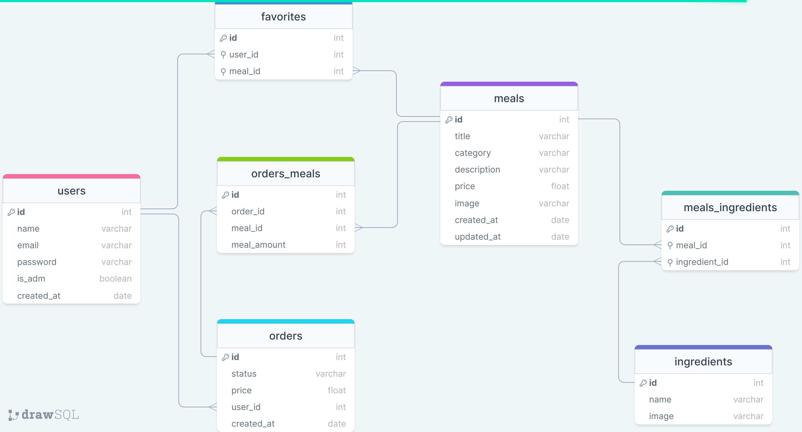

# :pizza: foodExplorer - Backend

Esse projeto é um cardápio digital para um restaurante fictício, conhecido como foodExplorer.

<h1 align="center">
    
</h1>

## :open_book: Sumário

- [Aviso](#loudspeaker-aviso)
- [Sobre](#memo-sobre)
- [Tecnologias](#floppy_disk-tecnologias)
- [Funcionalidades](#hammer-funcionalidades)
- [Utilização](#bulb-utilização)
- [Autor](#nerd_face-autor)

</br>

## :loudspeaker: Aviso

- A primeira versão do projeto **está finalizada**.

- Para testar o projeto, você pode clonar o repositório e testar localmente utilizando o NodeJS e o Insomnia.

- Você pode baixar o NodeJS [clicando aqui](https://nodejs.org/pt-br/download/).

- Você pode baixar o Insomnia [clicando aqui](https://insomnia.rest/download).

- A modelagem do banco de dados foi feita por mim.

</br>

## :memo: Sobre

Este é backend do Desafio Final do programa [Explorer da Rocketseat](https://www.rocketseat.com.br/explorer).

Essa aplicação simula um restaurante fictício, conhecido como foodExplorer, aonde usuários podem se cadastrar e logar.

Sendo o usuário um Administrador, ele poderá adicionar pratos, ingredients, atualizar pedidos, etc.

Sendo o usuário um Cliente, ele poderá atualizar o perfil, fazer um pedido, adicionar um produto as favoritos, etc.

Abaixo, temos a modelagem do banco de dados:

<h1 align="center">
    
</h1>

</br>

## :floppy_disk: Tecnologias

- **JS** - usado para fazer toda a lógica da aplicação;
- **NodeJs** - utilizado para executar o JS fora do navegador;
- **Express** - responsável por lidar com as requisições HTTP;
- **Jest** - utilizado para realizar testes de integração;
- **Sqlite** - usado para armazenar os dados;
- **Knex** - utilizado para gerar comandos SQL;
- **Multe** - usado para gerenciar o upload de imagens.
- **Git** - responsável por realizar o versionamento do código.

</br>

## :hammer: Funcionalidades

- [x] Cadastrar um usuário;
- [x] Atualizar e-mail, senha, ou nome de um usuário.
- [x] Mostrar informações de um pedido especifico;
- [x] Mostrar todos os pedidos de um usuário ou de todos os usuários.
- [x] Cadastrar, atualizar, mostrar ou deletar um prato.
- [x] Cadastrar, ou mostrar um ingrediente.
- [x] Criar, atualizar, mostrar informações de um pedido.

</br>

## :bulb: Utilização

```
  Em breve
```

---

## :nerd_face: Autor

Feito com :heart: por Dev Gustavo Santos :grinning: Veja meu [LinkedIn.](https://www.linkedin.com/in/devgustavosantos/)
